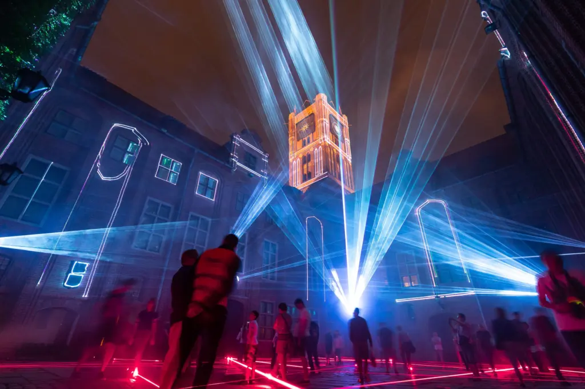

# Documentation de Laser Symphony

L'installation de Laser Symphony dans la cour du pavillon des Sciences biologiques à l'UQAM.

## Compagnie : Onda 

> Onda est un studio italien d'art numérique réunissant artistes visuels, musicien·ne·s, programmeur·rice·s et architectes. Ce studio crée des œuvres audiovisuelles interactives inspirées par la nature, les espaces urbains et les comportements sociaux. Onda explore la condition humaine à l'ère numérique, offrant des expériences immersives qui réinventent la relation avec l'art et l'environnement.

[Source : site du village numérique](https://village-numerique.mutek.org/fr/installations/laser-symphony-par-onda)

### Présenté par : CR34TE
### En cloaboration avec : AreaOdeon 
https://village-numerique.mutek.org/fr/installations/laser-symphony-par-onda
https://ondastudio.art/portfolio/laser-symphony/
https://tim-montmorency.com/582523-gestion/#/activites/2_corpus_multimedia/README?id=qui-
https://camo.githubusercontent.com/4a1d4cfa6596ba381fb749543de3af192e7b490492a0a1661a1646df41ad347b/68747470733a2f2f73332d65752d776573742d312e616d617a6f6e6177732e636f6d2f69682d6d6174657269616c732f75706c6f6164732f75706c6f61645f63626237346161393939666565386163326463636637373638396564363062342e706e67

## deuxième titre 2
