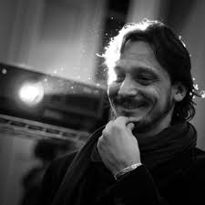
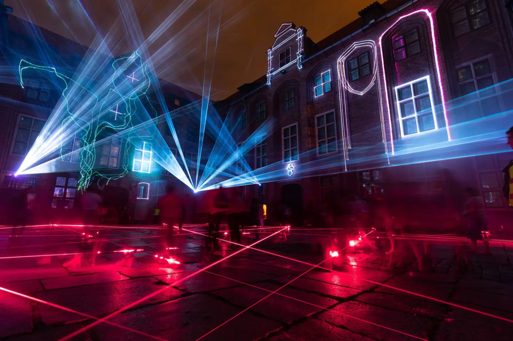
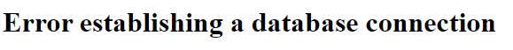

# Documentation de Laser Symphony par Onda

L'installation de Laser Symphony dans la cour du pavillon des Sciences biologiques à l'UQAM.

## Créateurs et Collaborateurs

### Compagnie : [Onda](https://ondastudio.art/) 

> Onda est un studio italien d'art numérique réunissant artistes visuels, musicien·ne·s, programmeur·rice·s et architectes. Ce studio crée des œuvres audiovisuelles interactives inspirées par la nature, les espaces urbains et les comportements sociaux. Onda explore la condition humaine à l'ère numérique, offrant des expériences immersives qui réinventent la relation avec l'art et l'environnement.

[Source : site du village numérique](https://village-numerique.mutek.org/fr/installations/laser-symphony-par-onda)

### Crédits 

#### Marcello Arosio  

#### Davide Cappelletti  
[Portfolio de Davide Cappelletti](https://zipzupzap.com/#portfolio)

### Présenté par : [CR34TE](https://cr34te.ca/)

>Notre mission est d’offrir à nos clients, à nos partenaires ainsi qu’à nos collaborateurs, un accompagnement de qualité personnalisé dans l’idéation de leurs projets lumineux les plus ambitieux. C’est en partageant nos connaissances, notre savoir faire ainsi que nos solutions novatrices que nous arrivons à faire la différence dans la création, la réalisation et la mise en place d’installations lumineuses temporaires  (location) ou permanentes (vente) .

[Source : site de CR34TE](https://cr34te.ca/a-propos/)

### En collaboration avec : [AreaOdeon](https://www.areaodeon.org/en/) (site inaccessible)

>Fondée en 2005, AreaOdeon promeut l'expérimentation et la recherche appliquées à l'art et à la culture contemporaine, définies comme des véhicules d'implication et de participation active du public, dans un horizon de collaborations continues avec des partenaires nationaux et internationaux.  
>Au fil des années, AreaOdeon a orienté ses recherches vers le contexte multimédia, audiovisuel et interactif, créant et promouvant des événements, des installations, des performances de mapping audiovisuel 3D qui mettent particulièrement l'accent sur la relation étroite entre les arts visuels, l'excellence architecturale, les contextes culturels et le patrimoine historique. 
>Dans ce contexte, s'inscrit Kernel Festival, plateforme internationale dédiée aux expressions de l'art contemporain liées à l'expérimentation technologique et à la valorisation du patrimoine historique et architectural, entièrement conçue, développée et réalisée par AreaOdeon.

[LinkediIn d'AreaOdeon](https://fr.linkedin.com/company/areaodeon)

### Partenaires 

[Conseil des arts du canada](https://conseildesarts.ca/)  
[MTLAB](https://mtlab.ca/)  
[Montréal](https://montreal.ca/)  
[Tourisme Montréal](https://www.mtl.org/fr)  
[Istituto Italiano di Cultura di Montreal](https://iicmontreal.esteri.it/fr/) (Institut Culturel Italien de Montréal)  
[Place des Arts](https://placedesarts.com/fr)  
[UQAM](https://uqam.ca/)  
[Quartier des spectacles Montréal](https://www.quartierdesspectacles.com/fr/)  
[La Presse](https://www.lapresse.ca/)  
[Gouvernement du Québec](https://www.quebec.ca/) 

## Dates pertinentes

### Date de création :

Vers 2017? Je n'ai trouvé aucune information sur la date de création exacte, mais la première présentations à été en 2017 à Crémone, Italie.

Laser Symphony à aussi été présenté à Riga en 2017, à Messine en 2017, à Torun en 2018, Leeuwarden en 2021 et à Québec en 2024

## Lieux pertinents 

La première présentation à eu lieu en 2017 à Crémone, une ville en Italie. L'oeuvre ne semble pas avoir été influencé par une culture

Laser Symphony à aussi été présenté à Riga en 2017, à Messine en 2017, à Torun en 2018, Leeuwarden en 2021 et à Québec en 2024

## Description et autres

### Description générale 

Aucune information est disponible pour l'exposition de 2024, mais la façon dont l'oeuvre est montré a chaque fois est similaire. Voici quelques photo du site du Village numérique pour l'exposition de 2024 :  
  
  
Malheureusement, les deux photos sur le site semblent être de l'exposition a Torun en 2018.

L'oeuvre est constitué de faisceaux lasers qui produisent une variété de sons lors d'une interaction et de projections laser qui illuminent les batiments autour de l'oeuvre. Cette combination audio-visuelle crée une symphonie de lumières et de sons qui se renouvelle avec chaque interaction du public.

Voici une petite video de 2018 pour mieux comprendre la combinaison de l'audio avec les laser:  
[Courte Video de l'exposition en 2018](https://vimeo.com/316975651)

### Objectif et Public cible

Laser Symphony crée un dialogue intime entre l'environment, l'art et le public en fusionnanttechnologie et architecture. Il a aussi pour but de venir augmenter la géométrie et les détails des batiments environnant.

>Laser Symphony invite à une réflexion sur notre relation à l'espace, à la technologie et à l'art interactif, tout en célébrant la beauté de l'architecture et de la nature environnante.  

[Source : site du village numérique](https://village-numerique.mutek.org/fr/installations/laser-symphony-par-onda)

Le public cible seraient ceux voulant explorer redécouvrir un lieu sous un nouvel angle.

### Aspects Aspects et Processus de création

Il n'y a malheureusement pas vraiment d'information sur les aspects techniques de Laser Symphony. Il est par contre clair qu'il y a des détecteur pour vérifier quand les laser sont traversés, car ceci active des lumières et part des sons spatialisés dans l'environnement. 

## Composante et Fonctionnements

### Composante centrale

Les laser font part entière de cette oeuvre, il serait presque possible de dire qu'ils font toute l'oeuvre car sans eux il n'y aurait plus rien. Bien évidemment, les détecteurs fonctionnent en pair avec les lasers.

### Fonctionnement 

Lorsque les lasers sont déclancher par le public, des lasers et lumières sont projeté sur les murs proche et des sons sont apparaissent dans l'instalation.

### Impact 

L'impact de cette composante est évidante, non seulement elle se comprend assez facilement, elle encourage les gens a continuer d'intéragir en explorant. Il est très facile de voir les changement dû à l'interaction avec les lasers.

## Appréciation et commentaire personnel

Ma raison pour avoir choisit cette oeuvre est assez simple, les photos des installations étaient attrayante au regard. Après des recherches plus approfondies, je suis triste d'apprendre que la documentation des site sont désastreux et qu'en plus le site de l'un de leurs collaborateur principal ne fonctionne plus pour une raison qui me dépasse.

  
Photo du site d'AreaOdeon au moment du travail

J'aurais aimé être présent lors de la présentation pour pouvoir mieux comprendre l'oeuvre et pour pouvoir jouer avec aussi avec les laser :disappointed:

